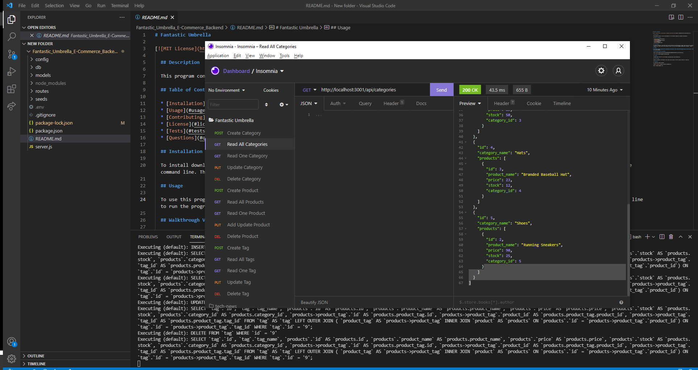

# Fantastic Umbrella

  
  ## Description 

  This program conatins a server and database for the Fantastic Umbrella E-commerce marketplace.
  
  ## Table of Contents
  
  * [Installation](#installation)
  * [Usage](#usage)
  * [Contributing](#Contributing)
  * [License](#license)
  * [Tests](#tests)
  * [Questions](#questions)
  
  ## Installation
  
  To install download or clone the files from the repository and open them in vscode. Then from the root directory run 'npm init' followed by 'npm install dotenv express mysql2 sequelize' in the command line. Then from the root directory go to the connect.js file and enter your mysql password between the '' on line where it says password:'',  
  
  ## Usage 
  
  To use this program complete the istallation instructions. Then iniate the database using the mysql commands 'mysql -u root -p' 'mysql source ./db/schema.sql' (note: you can also use 'npm seed' to fill in pre made data but its not necessary). Finally from the root directory run 'npm start' in the command line to run the program.

  ## Walkthrough Video & ScreenShot

  https://drive.google.com/file/d/1NlwZAZUuIESlWrxZBjd1MY15tYHITM-9/view?usp=sharing
  
  
  
  ## License
  
  Licensed under the [MIT License](https://choosealicense.com/licenses/mit/)
  
  ## Contributing
  
  Anyone is allowed to contribute to this open source project. See the License section for specifics

  ## Questions

  For questions please reachout

  GitHub: [NukaGrizz](https://github.com/NukaGrizz)

  Email: nukagrizz@gmail.com
